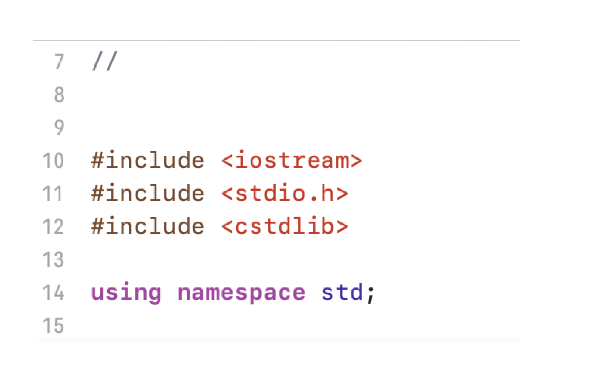

# Group2-CSCI313

Luke Fang - Part 2 and Part 7
Gomes Mikhaiel - Part 1 and Part 5
Hila Ergys - Part 6 and Part 9
Ibrat Nazara - Part 8 and Part 10
Kaur Rupinder - Part 3 and Part 4

# QUESTION 3
Create a sort for 2d matrices. Do a bubble sort, insertion sort, and selection sort variation of this.

# Libraries

# Main function
I create a 2d array and print statements to enter value for rows and columns. And a for loop to iterate through the array and which helps to gather the data.

# Bubble sort
Next, we wanted to sort the array using the bubble sort method. So, then I need a function to implement bubble sort. For that we use loops (for loop) and swap methods. Bubble Sort is basically the simplest sorting algorithm that works by repeatedly swapping the adjacent elements if they are in wrong order.

# Conclusion
After that the program will run properly and provide a sorted list.

#-------------------------------------------------------------------------------------------------------------

# QUESTION 4
A program for time taken to sort array list with bubble sort

# Main Function
In my main function, first I declared clock_t start and end variables and print statements to enter size of array and array elements. And a for loop to iterate through the array and which helps to gather the data.

# Bubble Sort
Next, we wanted to sort the array using the bubble sort method. So, then I need a function to implement bubble sort. For that we use loops (for loop) and swap methods. Bubble Sort is basically the simplest sorting algorithm that works by repeatedly swapping the adjacent elements if they are in wrong order.

# Conclusion
After that the program will run properly and provide a sorted list of arrays and time taken to sort the array list.

